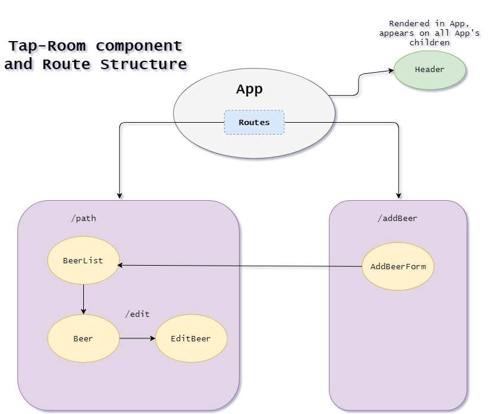

# Tap-Room

#### By Meria Thomas
## Component Structure

## Description
An app that displays a list of beer and also let's the employees edit and add beer to the list

## Setup/Installation Requirements

- Clone this repository

- Navigate to the root directory in your terminal and run "npm install" to install necessary plugins.

## Development server

Run `npm run start` for a dev server. Navigate to `http://localhost:8080/`. The app will automatically reload if you change any of the source files.

## Technologies Used

- jsx
- HTML & CSS
- Bootstrap
- React